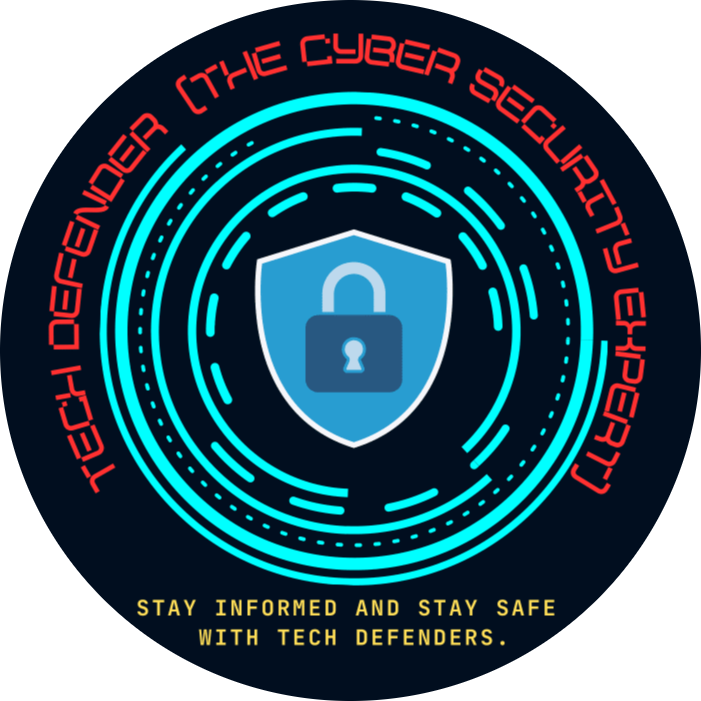

<p align="center">
  
</p>

<h1 align="center">CyberVerse: The Safe Click Challenge</h1>

<p align="center">
<b>An Interactive Cybersecurity Awareness Game</b>
</p>

<p align="center">
Developed by <b>TechDefenders (The Cyber Security Experts)</b>
</p>

<p align="center">
  
  
  
  
  
  
</p>

---

# 🛡️ Overview

**CyberVerse: The Safe Click Challenge** is an interactive browser-based cybersecurity awareness game developed by **TechDefenders (The Cyber Security Experts)**. The game educates users about real-world cyber threats through immersive, scenario-based gameplay and interactive decision-making.

Players encounter realistic cyber fraud situations such as phishing, UPI scams, AI voice cloning, digital arrest scams, QR code fraud, WhatsApp scams, and fake investment schemes. Every decision is followed by instant educational feedback, enabling users to learn safe cybersecurity practices through practical experience.

---

# 🎯 Objectives

- Promote cybersecurity awareness among citizens.
- Educate users about common cyber frauds.
- Encourage responsible digital behaviour.
- Improve cyber decision-making skills.
- Make cybersecurity learning engaging through gamification.

---

# ✨ Features

- 🎮 Interactive cybersecurity awareness game
- 🌐 Browser-based platform
- 🌍 English & Hindi language support
- 🔊 Voice narration using Web Speech API
- 🎵 Background music and sound effects
- ⏱️ Timer-based gameplay
- 📊 Mission Dashboard
- 🏆 Trust Score System
- 📈 Progress Tracking
- 📜 Certificate Generation
- 💻 Responsive User Interface
- 📡 Offline Support

---

# 🎮 Game Modules

CyberVerse currently includes awareness modules covering:

- UPI Payment Scam
- Fake QR Code Scam
- Phishing SMS Detection
- AI Voice Clone Scam
- Digital Arrest Scam
- WhatsApp Scam
- Fake Investment Scam
- Fake Job Scam
- Courier Scam
- Fake Tech Support Scam
- Mobile App Permission Scam
- Public Wi-Fi Security
- Emergency Cyber Response
- Social Engineering Awareness
- Safe Online Practices

---

# 🛠️ Technology Stack

### Frontend

- HTML5
- CSS3
- JavaScript (ES6)

### Backend

- Python

### Browser APIs

- Web Speech API
- Web Audio API

### Data Storage

- JSON

---

# 📂 Repository Structure

```text
CyberVerse_TheSafeClickChallenge/
│
├── audio.js
├── game.js
├── index.html
├── logos1.png
├── scenarios.json
├── server.py
├── style.css
└── voice.js
```

---

# 🚀 Getting Started

## Clone the Repository

```bash
git clone https://github.com/techdefenders1/CyberVerse_TheSafeClickChallenge.git
```

## Navigate to the Project

```bash
cd CyberVerse_TheSafeClickChallenge
```

## Run the Local Server

```bash
python server.py
```

## Open Your Browser

```
http://localhost:8000
```

---

# 👥 Team Details

## TechDefenders (The Cyber Security Experts)

| Team Member | Role & Contribution |
|-------------|---------------------|
| **Ujjwal Kumawat** | **Founder, TechDefenders (The Cyber Security Experts); ISEA Master Trainer & Cyber Ambassador (ISEA Phase III).** Project Lead responsible for the concept, game design, development, cybersecurity content integration, project management, and overall coordination of **CyberVerse: The Safe Click Challenge**. |
| **Shruti Sahu** | **Manager, TechDefenders (The Cyber Security Experts); ISEA Master Trainer & Cyber Ambassador (ISEA Phase III).** Contributed to research, cybersecurity content creation, game design, development, testing, and validation of awareness scenarios. |
| **Devidas Jamra** | **ISEA Master Trainer & Cyber Ambassador (ISEA Phase III).** Responsible for UI/UX design, graphics integration, gameplay testing, feature validation, and user experience improvements. |
| **Chhavi Gupta** | Responsible for documentation, quality assurance, presentation preparation, user feedback collection, and final project review. |

---

# 🎯 Target Audience

- Students
- Schools & Colleges
- Teachers
- Government Organizations
- Senior Citizens
- General Public (Non- Technical)
- Cybersecurity Awareness Campaigns

---

# 🚀 Future Enhancements

- Android & iOS Application
- Multiplayer Challenges
- AI-powered Adaptive Learning
- Regional Language Support
- Leaderboards
- Cloud Database Integration
- Learning Analytics Dashboard
- Additional Cybercrime Scenarios

---

# 🤝 Contributing

Contributions, ideas, and suggestions are welcome. If you would like to contribute:

1. Fork the repository.
2. Create a new feature branch.
3. Commit your changes.
4. Push the branch.
5. Submit a Pull Request.

---

# 📬 Contact

**TechDefenders (The Cyber Security Experts)**
- 📧 Email Id : techdefenders11@gmail.com
- 💼 LinkedIn: https://www.linkedin.com/company/techdefenders-the-cyber-security-experts/
- 📺 YouTube: http://www.youtube.com/@Techdefenders1?sub_confirmation=1

---

# ⭐ Support

If you found this project useful, please consider giving it a **⭐ Star** on GitHub. Your support helps us continue building innovative cybersecurity awareness solutions.

---

<p align="center">
<b>🛡️ Learn • Practice • Protect</b>
</p>

<p align="center">
Developed with ❤️ by <b>TechDefenders (The Cyber Security Experts)</b>
</p>
